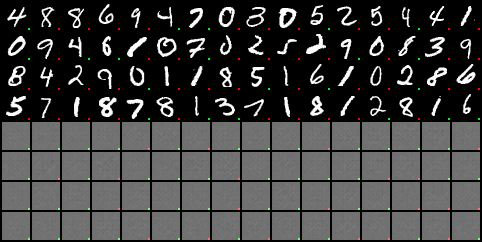
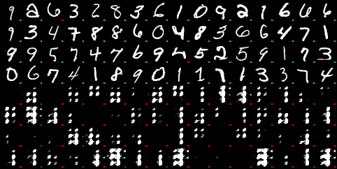
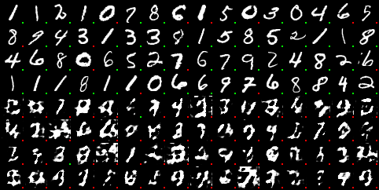
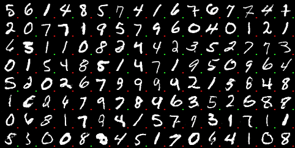

# Generation of handwritten digits using GANs

This repository demonstrates how to train a generator using a Generative Adversarial Network (GAN) to generate handwritten digits.

The dataset used is the MNIST dataset, which contains 60,000 training images and 10,000 testing images of handwritten digits.
The generator is trained to produce images that are indistinguishable from real images in the dataset.

## Example

The following image shows the initial state of the generator, which generates random noise.
At this stage, the discriminator's predictions are also random.
| ! |
|:---:|
| *Initial state of the generator. Upper half of the images correspond to real images and the lower half of the images correspond to the generated images. Colored pixels represent the predicted values of the discriminator, where green corresponding to real images and red corresponding to generate images.* |

After one epoch of training, the generator is still unable to produce images resembling real digits.
However, the discriminator has improved and can distinguish between real and fake images to some extent.
|  |
|:---:|
| *Generator after the first epoch of training. Upper half of the images correspond to real images and the lower half of the images correspond to the generated images. Colored pixels represent the predicted values of the discriminator, where green corresponding to real images and red corresponding to generate images.* |


After two epochs of training, the generator begins to create patterns that slightly resemble handwritten digits, though they are not yet recognizable.
The discriminator remains quite accurate in its predictions.
|  |
|:---:|
| *Generator after the second epoch of training. Upper half of the images correspond to real images and the lower half of the images correspond to the generated images. Colored pixels represent the predicted values of the discriminator, where green corresponding to real images and red corresponding to generate images.* |

At a later stage of training, the generator successfully produces images that closely resemble real handwritten digits.
Conversely, the discriminator struggles to distinguish between real and fake images.
|  |
|:---:|
| *Final state of the generator. Upper half of the images correspond to real images and the lower half of the images correspond to the generated images. Colored pixels represent the predicted values of the discriminator, where green corresponding to real images and red corresponding to generate images.* |


## Usage

1. Install dependencies.
    ```shell
    pip install -r requirements.txt
    ```

2. Run the training script: `train.py`.
